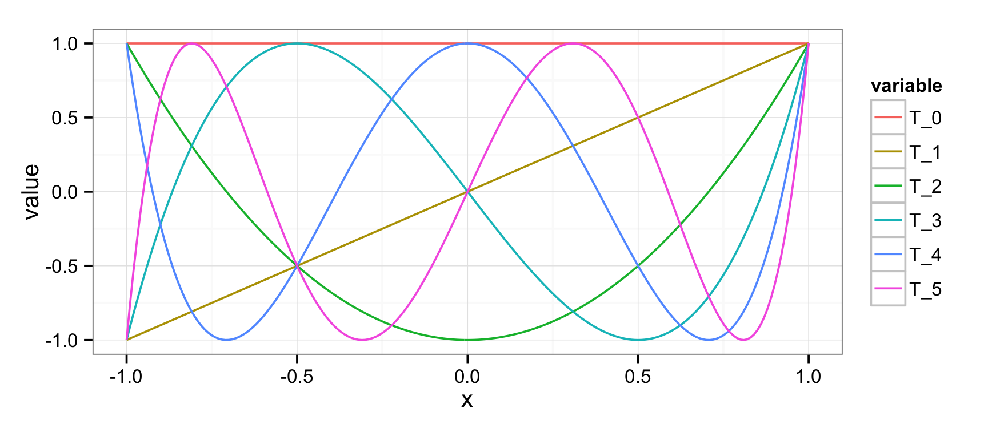
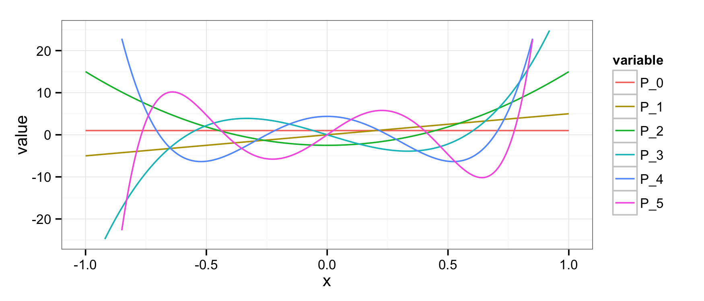
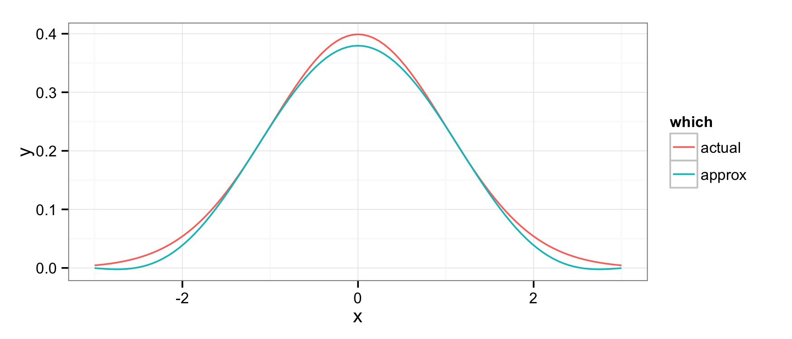

<!-- README.md is generated from README.Rmd. Please edit that file -->
mpoly
=====

Specifying polynomials
----------------------

**mpoly** is a simple collection of tools to help deal with multivariate polynomials *symbolically* and functionally in R. Polynomials are defined with the `mp` function:

``` r
library(mpoly)
#> Loading required package: stringr
mp("x + y")
#> x  +  y
mp("(x + 4y)^2 (x - .25)")
#> x^3  -  0.25 x^2  +  8 x^2 y  -  2 x y  +  16 x y^2  -  4 y^2
```

[Term orders](http://en.wikipedia.org/wiki/Lexicographical_order#Monomials) are available with the reorder function:

``` r
(p <- mp("(x + y)^2 (1 + x)"))
#> x^3  +  x^2  +  2 x^2 y  +  2 x y  +  x y^2  +  y^2
reorder(p, varorder = c('y','x'), order = 'lex')
#> y^2 x  +  y^2  +  2 y x^2  +  2 y x  +  x^3  +  x^2
reorder(p, varorder = c('x','y'), order = 'glex')
#> x^3  +  2 x^2 y  +  x y^2  +  x^2  +  2 x y  +  y^2
```

Vectors of polynomials (`mpolyList`s) can be specified in the same way:

``` r
mp(c("(x+y)^2", "z"))
#> x^2  +  2 x y  +  y^2
#> z
```

Polynomial arithmetic
---------------------

Arithmetic is defined for both polynomials (`+`, `-`, `*` and `^`)...

``` r
p1 <- mp("x + y")
p2 <- mp("x - y")

p1 + p2
#> 2 x
p1 - p2
#> 2 y
p1 * p2
#> x^2  -  y^2
p1^2
#> x^2  +  2 x y  +  y^2
```

... and vectors of polynomials:

``` r
(ps1 <- mp(c("x", "y")))
#> x
#> y
(ps2 <- mp(c("2x", "y+z")))
#> 2 x
#> y  +  z
ps1 + ps2
#> 3 x
#> 2 y  +  z
ps1 - ps2
#> -1 x
#> -1 z
ps1 * ps2
#> 2 x^2
#> y^2  +  y z
```

Some calculus
-------------

You can compute derivatives easily:

``` r
p <- mp("x + x y + x y^2")
deriv(p, "y")
#> x  +  2 x y
gradient(p)
#> y  +  y^2  +  1
#> x  +  2 y x
```

Function coercion
-----------------

You can turn polynomials and vectors of polynomials into functions you can evaluate with `as.function()`. For example, you can visualize a univariate polynomials like this:

``` r
f <- as.function(mp("(x-2) x (x+2)"))
#> f(x)
s <- seq(-2.5, 2.5, .1)
df <- expand.grid(x = s)
df$f <- apply(df, 1, f)

library(ggplot2)
qplot(x, f, data = df, geom = "line")
```


Or a bivariate polynomial like this:

``` r
f <- as.function(mp("x^2 - y^2")) 
#> f(.) with . = (x, y)
df <- expand.grid(x = s, y = s)
df$f <- apply(df, 1, f)
qplot(x, y, data = df, geom = "tile", fill = f)
```


Algebraic geometry
------------------

Grobner bases computations are available using **rSymPy**:

``` r
polys <- mp(c("t^4 - x", "t^3 - y", "t^2 - z"))
grobner(polys)
#> using variable ordering - t, x, y, z
#> Loading required package: rJava
#> -1 z  +  t^2
#> t y  -  z^2
#> -1 y  +  z t
#> x  -  z^2
#> y^2  -  z^3
```

Special polynomials
-------------------

You can construct [Chebyshev polynomials](http://en.wikipedia.org/wiki/Chebyshev_polynomials) as follows:

``` r
chebyshev(1)
#> x
chebyshev(2)
#> 2 x^2  -  1
chebyshev(0:5)
#> 1
#> x
#> 2 x^2  -  1
#> 4 x^3  -  3 x
#> 8 x^4  -  8 x^2  +  1
#> 16 x^5  -  20 x^3  +  5 x
```

And you can visualize them:

``` r
library(reshape2)

s <- seq(-1, 1, length.out = 201)
N <- 5 # number of chebyshev polynomials to plot
(chebPolys <- chebyshev(0:N))
#> 1
#> x
#> 2 x^2  -  1
#> 4 x^3  -  3 x
#> 8 x^4  -  8 x^2  +  1
#> 16 x^5  -  20 x^3  +  5 x

df <- t(sapply(s, as.function(chebPolys)) )
#> f(x)
df <- as.data.frame(cbind(s, df))
names(df) <- c("x", paste0("T_", 0:N))
mdf <- melt(df, id = "x")
qplot(x, value, data = mdf, geom = "line", color = variable)
```



[Bernstein polynomials](http://en.wikipedia.org/wiki/Bernstein_polynomial) are available with `bernstein()`:

``` r
bernstein(0:4, 4)
#> x^4  -  4 x^3  +  6 x^2  -  4 x  +  1
#> -4 x^4  +  12 x^3  -  12 x^2  +  4 x
#> 6 x^4  -  12 x^3  +  6 x^2
#> -4 x^4  +  4 x^3
#> x^4

s <- seq(0, 1, length.out = 101)
N <- 5 # number of bernstein polynomials to plot
(bernPolys <- bernstein(0:N, N))
#> -1 x^5  +  5 x^4  -  10 x^3  +  10 x^2  -  5 x  +  1
#> 5 x^5  -  20 x^4  +  30 x^3  -  20 x^2  +  5 x
#> -10 x^5  +  30 x^4  -  30 x^3  +  10 x^2
#> 10 x^5  -  20 x^4  +  10 x^3
#> -5 x^5  +  5 x^4
#> x^5

df <- t(sapply(s, as.function(bernPolys)) )
#> f(x)
df <- as.data.frame(cbind(s, df))
names(df) <- c("x", paste0("B_", 0:N))
mdf <- melt(df, id = "x")
qplot(x, value, data = mdf, geom = "line", color = variable)
```



You can use the `bernsteinApprox()` function to compute the Bernstein polynomial approximation to a function. Here's an approximation to the standard normal density:

``` r
p <- bernsteinApprox(dnorm, 15, -1.25, 1.25)
round(p, 4)
#> 0.0001 x^8  -  0.002 x^6  +  0.0262 x^4  -  0.1624 x^2  +  0.3796

x <- seq(-3, 3, length.out = 101)
df <- data.frame(
  x = rep(x, 2),
  y = c(dnorm(x), as.function(p)(x)),
  which = rep(c("actual", "approx"), each = 101)
)
#> f(x)
qplot(x, y, data = df, geom = "line", color = which)
```


Bezier polynomials and curves
-----------------------------

You can construct [Bezier polynomials](http://en.wikipedia.org/wiki/Bézier_curve) for a given collection of points with `bezier()`:

``` r
points <- data.frame(x = 0:3, y = c(0,1,-1,0))
(bezPolys <- bezier(points))
#> 3 t
#> 6 t^3  -  9 t^2  +  3 t
```

And viewing them is just as easy:

``` r
df <- t(sapply(s, as.function(bezPolys)) )
#> f(t)
df <- as.data.frame(df)
names(df) <- c("x", "y")
qplot(x, y, data = df, geom = "line") +
  geom_line(data = points, color = "red") +
  geom_point(data = points, color = "red", size = 4)
```



Other stuff
-----------

I'm starting to put in methods for some other R functions:

``` r
n <- 101
df <- data.frame(x = seq(-5, 5, length.out = n))
df$y <- with(df, -x^2 + 2*x - 3 + rnorm(n, 0, 2))

mod <- lm(y ~ x + I(x^2), data = df)
(p <- round(as.mpoly(mod)))
#> 2.003 x  -  0.986 x^2  -  3.285
qplot(x, y, data = df) +
  stat_function(fun = as.function(p), colour = 'red')
#> f(x)
```


Installation
------------

-   From CRAN: `install.packages("mpoly")`

-   From Github (dev version):

    ``` r
    # install.packages("devtools")
    devtools::install_github("Rexamine/stringi")
    devtools::install_github("hadley/stringr")
    devtools::install_github("dkahle/mpoly")
    ```
